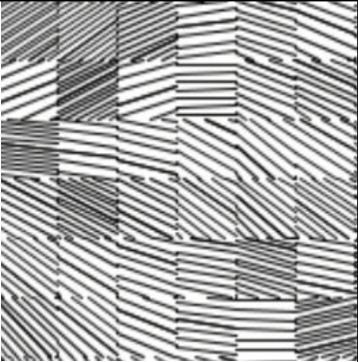
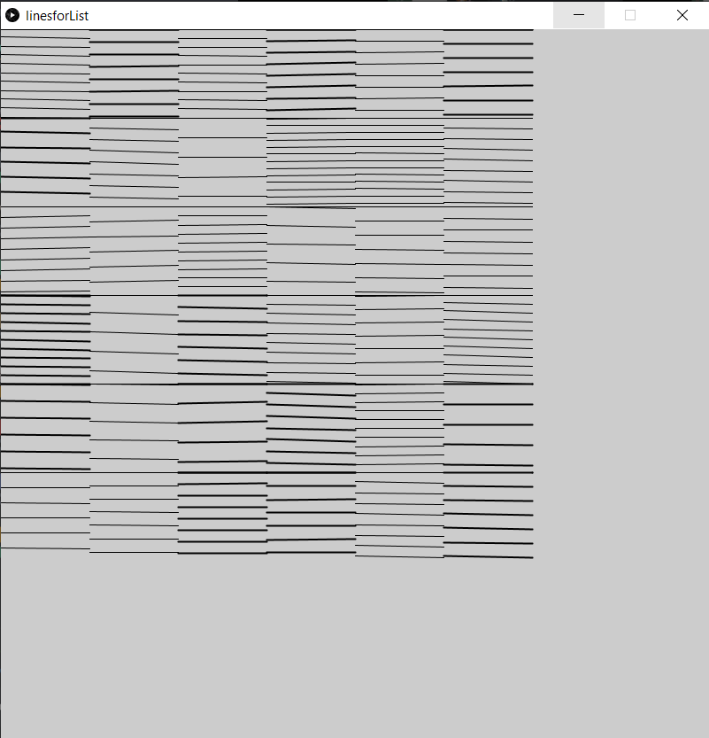
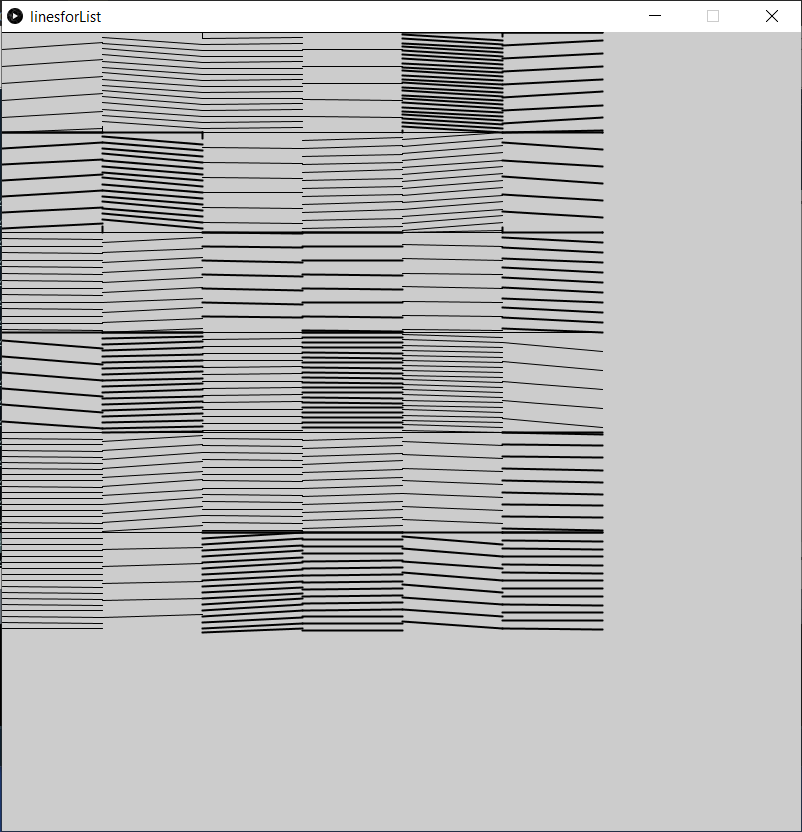

# Caso # 4

| Integrantes               | Carnet     |
|---------------------------|------------|
| Andrés Sánchez Rojas      | 2018100180 |
| Ana María Guevara Roselló | 2018102514 |


Dado un patrón visual de pintado, reproduzcalo utilizando C++.
El algoritmo debe recibir como parámetro el alto y ancho del área donde se va a pintar.

##### Explicación del código:
El algoritmo toma una matriz de 6 filas x 6 columnas, en cada una de las casillas va a generar lineas, siguiendo un patrón, donde interviene una pendiente, una distancia entre líneas y un grueso random. Las lineas por tanto serán una lista [x1, y1, x2, y2, grueso].

En este caso, el patrón a reproducir es el siguiente:



##### Ejemplos:
Aqui podemos ver los diferentes patrones generados utilizando el codigo.
En el primer ejemplo podemos ver un patron con el código modificado para obtener lineas más distanciadas y de menor inclinación:


En este ejemplo podemos ver un patron con menor distancia entre las lineas y mayor inclinación:


Podemos encontrar más pruebas, dentro de la carpeta Imgs.


#### Análisis del O(n):
Podemos encontrar dentro del codigo que para generar este patrón se hace un recorrido del ancho dado por el usuario, y a su vez, por cada recorrido del ancho, se hace un recorrido de la altura/6 , generando lineas en este rango. La cantidad de líneas de cada cuadro va a estar definida por:
```
(altura/6) / distancia entre las lineas
```

Tomando como n la cantidad de las líneas generadas, obtenemos:

```
int designFigure(int pWidth,int pHeight, int plineArray[800][5]){ // 6 + 1441 + 2268n -> f(1447 + 2268n) -> O(n)
```

Dado que el for externo es un constante de 6 x 6, no agrega complejidad, el for interno es el encargado de generar las líneas, que corresponden al n. Obteniendo como resultado un  _f(1447 + 2268n)_ y una complejidad de _O(n)_ para el peor de los casos.

Podemos encontrar un análisis y conteo de cada sección del código en el archivo [Conteo.cpp](Conteo.cpp)

##### Opcional: Prueba en Processing

Para generar el patrón podemos utilizar el código [linesforList.pde](linesforList/linesforList.pde) y remplazar el parámetro lines con el resultado obtenido al correr el algorimo en [Caso4.cpp](Caso4.cpp).

```
int[][] lines= {contenido del caso4.cpp}

void setup(){
  size(800,800);                  //Ancho y alto
  for(int[] i : lines){            //recorrido de lines
      strokeWeight(i[4]);          //Grueso de la linea
      line(i[0],i[1],i[2],i[3]);   //line(x1,y1,x2,y2)
  }
}
```

El código de processing se encuentra precargado con uno de las pruebas realizadas.
